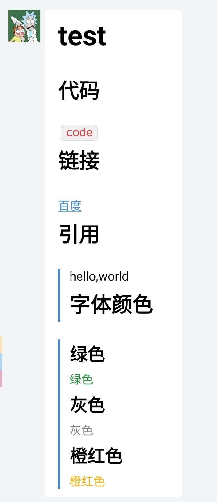
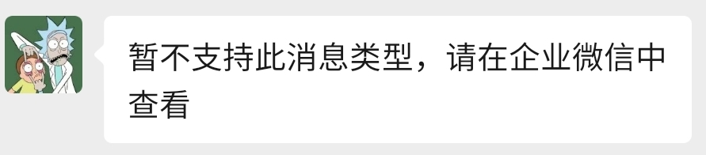

# PushMessege

通过get向多种渠道(bark,企业微信,flomo)推送消息

## Features

1. 企业微信应用推送文字消息
2. ios bark应用推送文字消息
3. 推送文字到flomo

## Usage

1. `pip install -r requirements.txt`
1. 修改`config.ini`文件或者创建`config_custom.ini`文件, 并对应`config.ini`文件自定义对应的键
1. `uvicorn server:app`

### 企业微信

`server/corwechat/method?message=`

`method`目前包括`markdown`, `text`

#### text

emmm,没啥好说的

example:

`corwechat/text?message=hello, world!`

(url特殊字符请自行转码)

#### markdown

语法:

`\n`换行,使用`@`代替`#`实现.
目前企业微信官方支持的语法可以全部实现.(2021/03/23)

example:

`server/corwechat/markdown?message=@test\n@@代码\n`code`\n@@链接\n[百度](www.baidu.com)\n@@引用\n>hello,world\n@@字体颜色\n@@@绿色\n<font%20color="info">绿色\n@@@灰色\n<font%20color="comment">灰色\n@@@橙红色\n<font%20color="warning">橙红色`

展示:

值得注意的是, markdown方式, 仅能在企业微信查看, 微信企业号不能正常展示

### bark

`server/bark/message`

### mail

`/mail?towho=mailadrees&title=test&content=hello,world`

## TODO

1. 完善已有的各种推送方式
   - 企业微信(目前暂时不打算完善图片及以下功能,推送图片与本项目只想用到`get`的初衷不符,后续可能更新推送在线文件的功能)
     - [x] text
     - [x] markdown
     - [ ] 图片
     - [ ] 视频
     - [ ] 音频
     - [ ] 文件
     - [ ] 图文
   - bark(暂时也不打算补全,原因是私以为没什么卵用)
     - [x] text
     - [ ] url
     - [ ] 复制到粘贴板
     - [ ] 铃声

2. 增加各类api功能
    - [x] bark
    - [x] flomo
    - [x] 企业微信 
    - [x] 邮件

## 更新日志

### 0.3

增加mail功能(yagmail方式)

### 0.2.2

1. 企业微信增加`markdown`方法

### 0.2.1

1. 增加flomo推送方式
1. 使用个人觉得更优雅的config方式(configparser)
1. 给企业微信方式增加了一个token过期验证, 少一个get或许能快点吧
